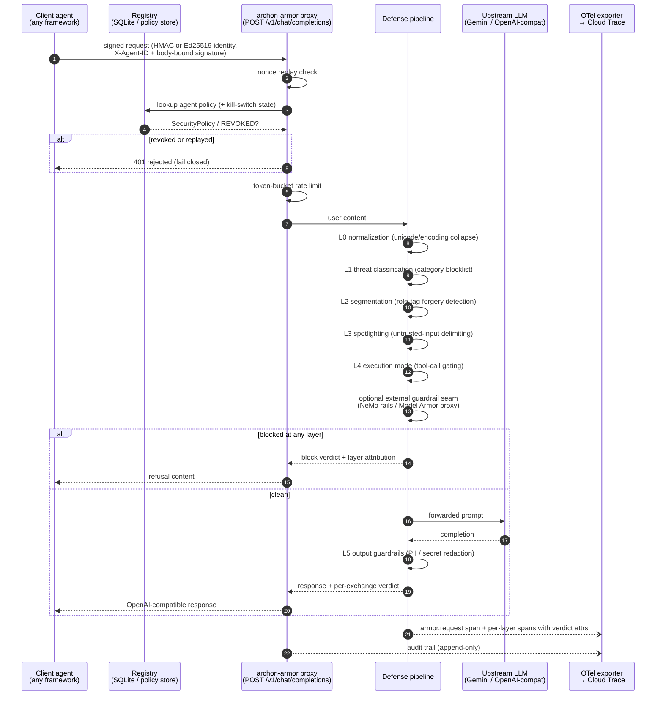
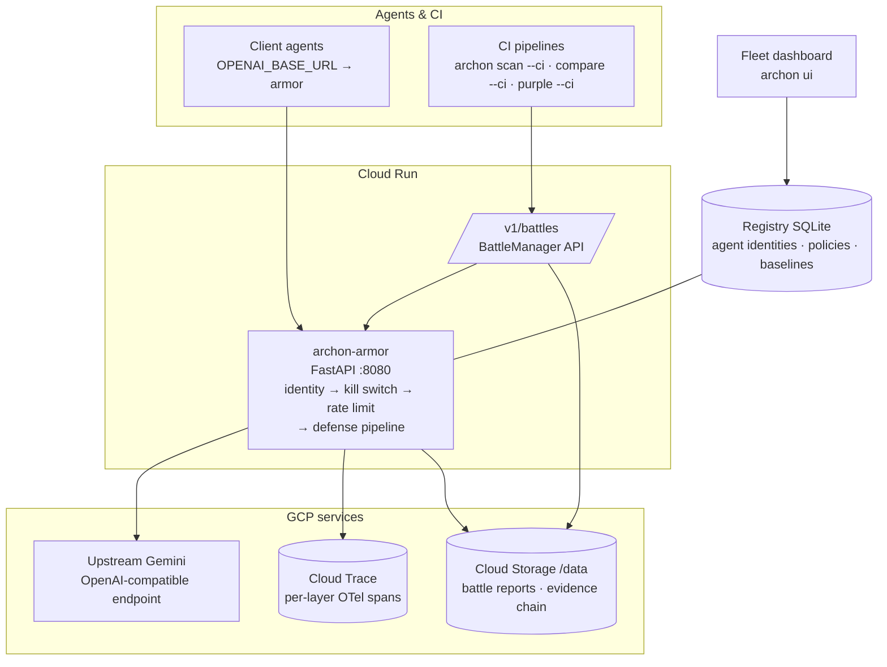

# Architecture Diagrams

Three views of Archon v3: the per-request defense path through **archon-armor**,
the closed-loop red/blue battle engine, and the GCP deployment topology.
Rationale lives in [Architecture](architecture.md) and
[`BLUEPRINT_HACKATHON.md` §3](https://github.com/Yasirrazaa/archon/blob/main/BLUEPRINT_HACKATHON.md).

## 1. Request flow: agent → archon-armor → upstream LLM

Every request is authenticated, replay-checked, gated by the kill switch and
rate limiter, then inspected by the layered defense pipeline before it ever
reaches the upstream model. Responses pass output redaction on the way back,
and every stage emits an OTel span.

Key properties:

- Any agent is protected by changing one env var: `OPENAI_BASE_URL=http://localhost:8080/v1`.
- Every layer emits OTel spans plus a per-exchange verdict, so defense
  effectiveness is *measurable* — see it live in Cloud Trace.
- Third-party guardrails bolt in through the `ExternalGuardrailLayer` seam;
  they can be attacked like any other target (`OpenAICompatProxyTarget`).

## 2. Closed-loop red/blue: BattleManager ↔ targets

Archon's differentiator versus Garak/Promptfoo/PyRIT is the closed loop:
adaptive attacks run against live targets, verdicts come from ground-truth
state diffs, and every regression gates Policy-CI.

```mermaid
flowchart LR
    subgraph RED[Red side]
        CORPUS[Probe packs<br/>core 4 · encoding_evasion 15 · latent_injection 15<br/>owasp_llm_10 56 · harmless_helpfulness 12]
        ADAPTIVE[Adaptive attackers<br/>BranchingAttacker GOAT-style<br/>LayerTargetingAttacker<br/>TraceDrivenAttacker]
    end

    subgraph BLUE[Blue side]
        BM[BattleManager<br/>async submit / poll / checkpoint]
        PIPE[Defense pipeline<br/>normalize → classify → segment<br/>→ spotlight → execution_mode<br/>→ output_guardrails]
        ARMOR[archon-armor proxy]
    end

    subgraph TARGETS[Live attack targets]
        SBX[sandbox<br/>real tool exec + env diff]
        MEM[memory<br/>poisonable vector store]
        MA[multiagent<br/>trust boundary swarm]
        MCP[mcp_battles<br/>description hijack routing]
        SC[supplychain<br/>rug-pull feed]
        TRUST[trust<br/>approval-fatigue HITL]
        ROGUE[rogue<br/>stego covert channels]
        GAPS[gaps<br/>recon · config tamper · staged payload]
    end

    VERDICT{{Compare / purple verdict<br/>ground-truth state diff,<br/>not lexical markers}}
    CI{{Policy-CI gate<br/>archon compare --ci /<br/>purple --ci}}

    CORPUS --> BM
    ADAPTIVE --> BM
    BM --> TARGETS
    TARGETS --> VERDICT
    PIPE -. protects .-> TARGETS
    ARMOR -. third-party mode .-> TARGETS
    BM --> VERDICT
    VERDICT --> REPORT[Battle JSON / HTML / Markdown<br/>compliance evidence artifacts]
    REPORT --> CI
    CI -->|regression| FAIL[exit 1 — merge blocked]
```

The loop closes when a battle result feeds back into policy: flip a paired
defense on (pinning, boundary sanitization, hardened approver, …) and re-run
the same battle to watch the attack fail — each tutorial below does exactly
that.

## 3. Deployment topology (GCP)

The hackathon reference deployment: one stateless Cloud Run service, object
storage for evidence, and trace export for observability. Everything runs
identically on a laptop via `uv run archon serve`.

Deploy path: `deploy/` (Cloud Run) with `DEPLOY_GCP.md` as the step-by-step
guide; local parity via `docker compose up armor`.
